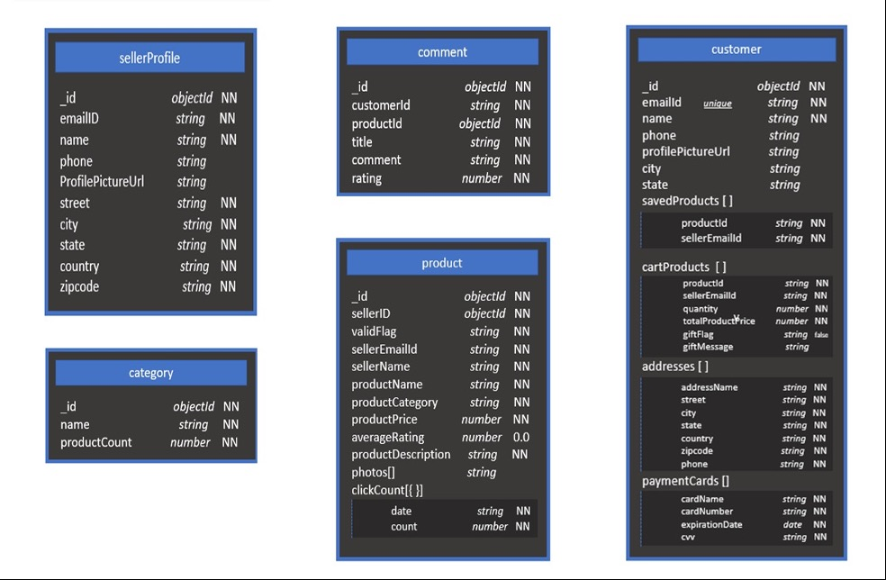
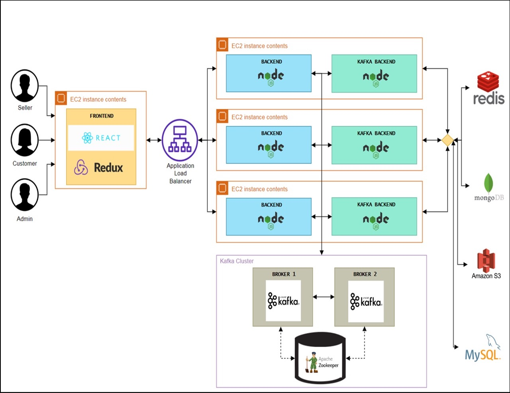
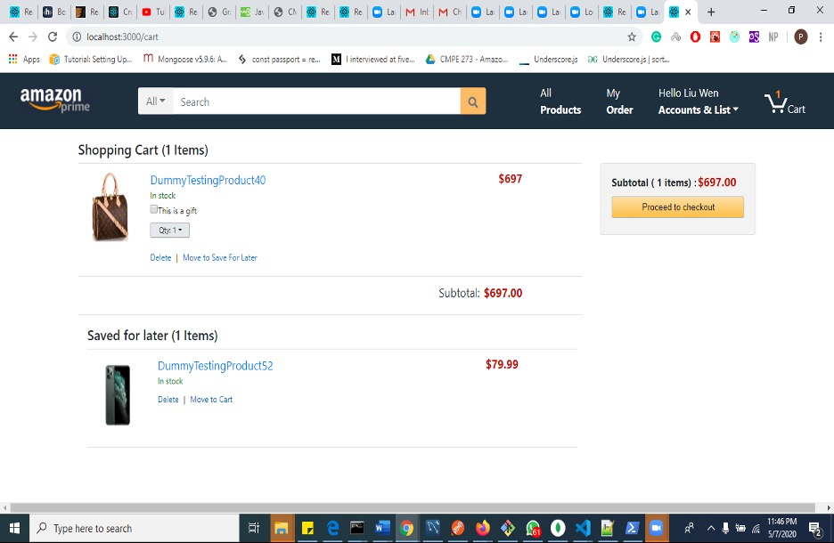

# AmazonPrototype
## This repository contains working prototype for Amazon.com, an e-commerce web application.

###### Database schema:

###### System Architecture and Design:

###### Object management policy
We are storing different types of objects in different file storage systems. The objects that are incoherent and do not need any relations to be fetched are stored in MongoDB. MongoDB also makes it quicker to fetch data by avoiding joins, making it read easy. All the important information is stored in MySQL to maintain ACID (Atomicity, Consistency, Isolation, and Durability) state. Large objects like pictures and images are stored in an Amazon S3 bucket and can be easily accessed by URL. All these are stored on different cloud instances and they are made to work synchronously without any duplication of data keeping the system in a single state.

###### Handling heavy weight resources
Firstly, we made the resources read easy and write intensive. Like in products collection we had denormalized a lot of columns, but it made it easier to fetch products and get related data. Similarly, the same policy was followed. Secondly, we used Redis cache to store large collections like products to make it faster to read. Finally, images were stored in AmazonS3 bucket instead of blob format in the DB, increasing the read times and improving efficiency.

###### Application

